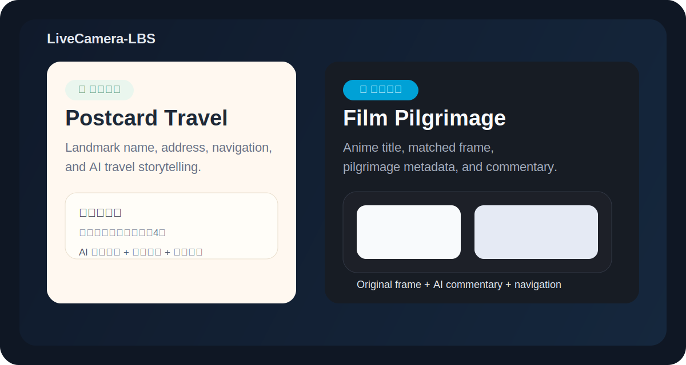
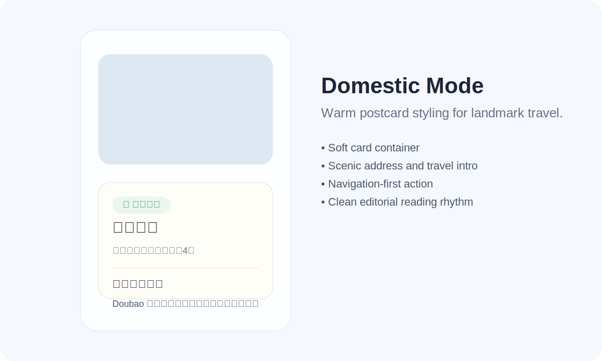
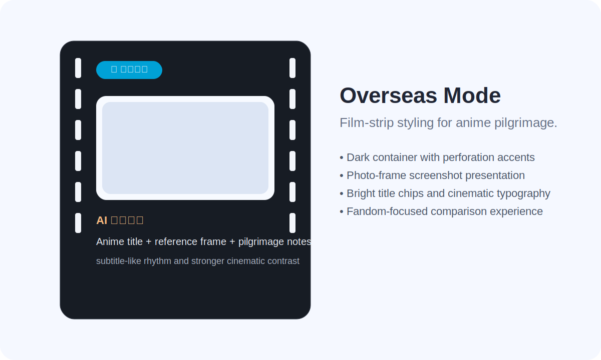
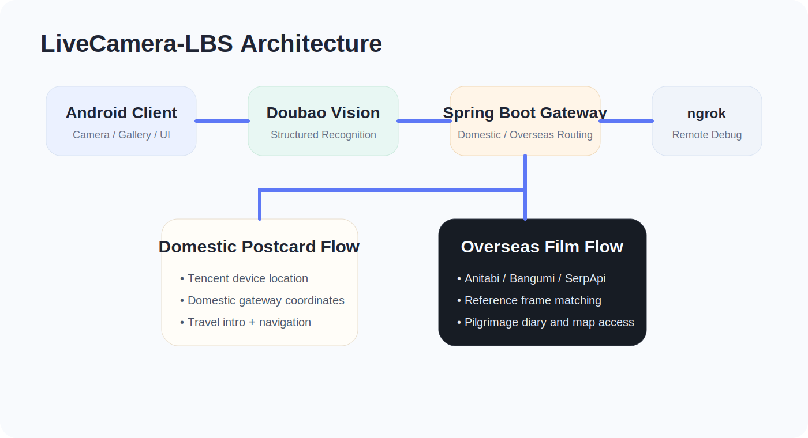

# LiveCamera-LBS

<p align="center">
  
</p>

<p align="center">
  
  
  
  
  
</p>

<p align="center">
  A portfolio-grade Android project that combines multimodal AI recognition, location intelligence, and dual-scene experience design.
</p>

---

## Summary

### 中文简介
LiveCamera-LBS 是一个围绕“拍下眼前风景，进入正确体验路径”而设计的 Android 作品集项目。用户拍摄或选择一张真实世界的照片后，客户端会通过 Doubao Vision 对场景进行识别，并解析结构化结果。系统根据 `is_domestic` 自动分流：

- 国内场景进入“明信片”旅游模式  
  聚焦景点名称、详细地址、旅游科普介绍与地图导航
- 海外场景进入“巡礼胶片”动漫模式  
  聚焦作品匹配、原片参考图、圣地对比与巡礼解说

这不是一个停留在“识别是什么”的 demo，而是一个把 AI 理解、LBS 路由和 UI 语义设计真正串起来的 scenario-aware prototype。

### English Summary
LiveCamera-LBS is an Android prototype built around a simple idea: take a photo of a real-world scene, let multimodal AI understand it, and route the user into the right experience.

After recognition via Doubao Vision, the app branches into:

- **Domestic Postcard Mode** for mainland China landmarks  
  focused on address, travel storytelling, and navigation
- **Overseas Film Mode** for anime pilgrimage scenes  
  focused on title matching, reference frames, and fandom-oriented comparison

This project demonstrates not only mobile engineering integration, but also product thinking across AI parsing, LBS capability, and scenario-specific UI design.

---

## Highlights

- Dual-mode product architecture driven by structured AI recognition
- Android client implemented in Java with production-style async flow control
- Domestic travel flow integrated with Tencent location capability
- Overseas pilgrimage flow integrated with Anitabi / Bangumi / SerpApi
- Room-based local check-in diary for persistent user memory
- Emulator and real-device backend联调 support
- UI differentiation between two distinct emotional product identities

---

## Product Preview

### Domestic Mode · Postcard Travel

<p>
  
</p>

**Design language**

- warm postcard-like card container
- calm editorial spacing and typography
- landmark-first information hierarchy
- navigation as the primary action
- AI-generated travel introduction for leisure reading

### Overseas Mode · Film Pilgrimage

<p>
  
</p>

**Design language**

- dark film-strip inspired container
- vivid anime-themed badge
- white-framed visual reference area
- subtitle-like commentary typography
- stronger contrast for emotional immersion

---

## Architecture

<p>
  
</p>

### High-Level Flow

```text
Camera / Gallery Image
        ↓
Doubao Vision Multimodal Recognition
        ↓
Parse structured result:
- anime_names
- location_name
- description
- is_domestic
        ↓
        ├── is_domestic = true
        │      ↓
        │   Tencent single-shot location
        │      ↓
        │   Spring Boot location gateway
        │      ↓
        │   Postcard travel UI + navigation + check-in
        │
        └── is_domestic = false
               ↓
            Overseas route gateway
               ↓
            Anitabi / Bangumi / SerpApi fallback
               ↓
            Film pilgrimage UI + reference matching + diary
```

---

## Tech Stack

### Android Client

- Java
- Android SDK
- Material Design Components
- Glide
- Gson
- OkHttp
- Room
- Tencent Location SDK
- Doubao Vision API

### Companion Backend

- Java
- Spring Boot
- RESTful API
- smart routing gateway for domestic / overseas scenes
- ngrok-compatible remote debugging workflow

### External Services

- Doubao Vision multimodal recognition
- Tencent map / location capability
- Anitabi pilgrimage data
- Bangumi metadata
- SerpApi image fallback

---

## Repository Structure

```text
livecamera/
├── app/                       # Android application module
│   ├── src/
│   ├── build.gradle.kts
│   └── ...
├── docs/
│   └── assets/                # README visual assets
├── scripts/
│   └── upload_to_github.bat   # Windows upload helper
├── gradle/
├── build.gradle.kts
├── settings.gradle.kts
└── README.md
```

> Note  
> This repository currently hosts the Android client. The Spring Boot intelligent gateway is used as a companion backend service during联调 and deployment.

---

## Companion Backend API

### Location Search

```http
GET /api/location/search?keyword={keyword}&isDomestic={true|false}
```

### Example Response

```json
{
  "name": "故宫博物院",
  "address": "北京市东城区景山前街4号",
  "longitude": 116.397,
  "latitude": 39.918
}
```

### Behavior

- `200 OK`: location found
- `404 Not Found`: location not found

---

## Quick Start

### 1. Build Android Client

From the repository root:

```bash
./gradlew.bat :app:assembleDebug --console=plain
```

Then open the project in Android Studio and run it on:

- Android Emulator
- Physical Android Device

### 2. Start Companion Backend

Run the Spring Boot gateway in your backend project separately:

```bash
./mvnw spring-boot:run
```

Default local backend address:

```text
http://localhost:8080
```

### 3. Optional GitHub Upload Script

A Windows batch helper is included here:

```text
scripts/upload_to_github.bat
```

It can help you:

- initialize Git if needed
- add all files
- create a commit
- ask for the remote repository URL
- push the project to GitHub

Before using it, please check `.gitignore` carefully to avoid uploading `build/`, `.gradle/`, `.idea/`, `target/`, `local.properties`, and other local or generated files.

---

## Configuration

### Doubao Vision

Configure the following in `local.properties` or Gradle properties:

- `DOUBAO_BASE_URL`
- `DOUBAO_API_KEY`
- `DOUBAO_MODEL`

### Tencent Map / Location

- `TENCENT_MAP_SDK_KEY`

### Android → Backend Base URL

For emulator:

```text
http://10.0.2.2:8080
```

For physical devices, replace with your LAN IP:

```text
http://192.168.1.100:8080
```

---

## ngrok Remote Debugging

When the backend needs to be accessed by a real mobile device outside the local direct environment, use ngrok:

```bash
ngrok http 8080
```

Then replace the Android-side backend base URL with the generated public tunnel address.

This is especially helpful for:

- real-device joint debugging
- remote demo sessions
- portfolio recording
- cross-network integration verification

---

## UI / UX Design Thinking

### Domestic Mode: "Postcard"

The domestic experience is warm, calm, and editorial.

- landmark-first presentation
- travel-friendly reading rhythm
- address and introduction as primary content
- navigation-first CTA
- visual tone closer to a refined postcard than a utility app

### Overseas Mode: "Film"

The overseas experience is more emotional, collectible, and cinematic.

- film-strip inspired container
- fandom-oriented visual hierarchy
- screenshot presentation with framed-photo feeling
- commentary typography inspired by subtitle rhythm
- stronger contrast to emphasize scene comparison

The design goal is not just visual difference, but **semantic difference**:  
the UI should tell the user what kind of journey they are on before they even start reading.

---

## Why This Project Stands Out

LiveCamera-LBS is not just a technical integration sample. It demonstrates:

- multimodal AI as a business decision input
- backend routing as a product intelligence layer
- frontend architecture shaped by scene semantics
- scenario-specific UI rather than one-size-fits-all presentation
- thoughtful integration between recognition, navigation, and memory capture

This makes the project especially suitable for a portfolio that aims to showcase:

- Android engineering
- full-stack product implementation
- AI-enhanced UX architecture
- map / LBS capability
- practical scenario-driven design thinking

---

## Future Directions

- route planning and nearby POI recommendation
- weather / ticket / opening-hours integration for domestic mode
- multi-point anime pilgrimage route generation
- cloud sync for user diary data
- multilingual support
- production deployment with auth, analytics, and observability

---

## Author Note

LiveCamera-LBS is designed as a portfolio-grade prototype that balances engineering implementation with product polish.

It aims to answer a more interesting question than "can AI recognize this image?":

**Can AI recognize a scene, understand the user's context, and then guide them into the right experience?**
